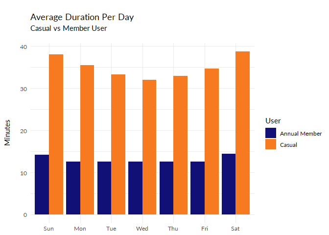

Bike-Share Cyclistic Data Analysis With R
================
Jaenal Aripin
2024-02-15


Cyclistic is a bike-share program that features more than 5,800 bicycles
and 600 docking stations. Cyclistic sets itself apart by also offering
reclining bikes, hand tricycles, and cargo bikes, making bike-share more
inclusive to people with disabilities and riders who can’t use a standard
two-wheeled bike. The majority of riders opt fort aditional bikes; about
8% of riders use the assistive options. Cyclistic users are more likely
to ride for leisure, but about 30% use the bikes to commute to work each
day.

## Table of Contents

- [1. Business Task](#cell1)<br>
- [2. Data Source](#cell2)<br>
- [3. Cleaning and Manipulation of Data](#cell3)<br>
- [4. Analysis](#cell4)<br>
- [5. Visualizations](#cell5)<br>
- [6. Key Findings](#cell6)<br>
- [7. Recommendations](#cell7)<br>

<a id="cell1"></a>

## 1. Business Task

Cyclistic have two types of users. First one is casual users that
includes single-ride and full-day passes users and the second one is
annual members. This analysis will help you answer this question:

- How do annual members and casual riders use Cyclistic bikes
  differently?

<a id="cell2"></a>

## 2. Data Source

We used Cyclistic’s historical trip data to analyze and identify trends.
We downloaded the previous 12 months of Cyclistic trip data
[here](https://divvy-tripdata.s3.amazonaws.com/index.html). (Note: The
datasets have a different name because Cyclistic is a fictional company. For the purposes of this case study, the datasets are appropriate and will enable us to answer the business questions. The data has been made
available by Motivate International Inc. under this
[license](https://divvybikes.com/data-license-agreement).) We downloaded
only the data sets from 2019. The data are divided into 4 quarters per
year (Q1, Q2, Q3, and Q4).

<a id="cell3"></a>

## 3. Cleaning and Manipulation of Data

### 3.1. Importing Data Sets

Our datasets are not clean. We have to perform some cleaning and
manipulation processes so they can be used for further analysis.

We use RStudio to perform all the processes, from importing, cleaning,
analyzing, visualizing, and reporting. First step is the importing
process. Here, we prepare the data we want to use for analysis. The
datasets are divided into 4 separate files. We use `read_csv` function
from `readr` package to import external csv files. Here is the code to
import all of them:

``` r
library(readr)        #loading readr package to enable read_csv function                                                              
bike2019 <- read_csv("F:/Data Analytics/Case Studies/Bike Share/R/Divvy_Trips_2019_Q1.csv")        #importing dataset of Q1
bike20192 <- read_csv("F:/Data Analytics/Case Studies/Bike Share/R/Divvy_Trips_2019_Q2.csv")       #importing dataset of Q2
bike20193 <- read_csv("F:/Data Analytics/Case Studies/Bike Share/R/Divvy_Trips_2019_Q3.csv")       #importing dataset of Q3
bike20194 <- read_csv("F:/Data Analytics/Case Studies/Bike Share/R/Divvy_Trips_2019_Q4.csv")       #importing dataset of Q4
```

### 3.2. Cleaning Data Sets

These four files need to be merged into one data set for further
analysis. Before that, we need to check the preview of each data set
with `glimpse` function from the `dplyr` package.

``` r
library(dplyr)
glimpse(bike2019)     #checking the structure of Q1 data set
```

    ## Rows: 365,069
    ## Columns: 12
    ## $ trip_id           <dbl> 21742443, 21742444, 21742445, 21742446, 21742447, 21…
    ## $ start_time        <dttm> 2019-01-01 00:04:37, 2019-01-01 00:08:13, 2019-01-0…
    ## $ end_time          <dttm> 2019-01-01 00:11:07, 2019-01-01 00:15:34, 2019-01-0…
    ## $ bikeid            <dbl> 2167, 4386, 1524, 252, 1170, 2437, 2708, 2796, 6205,…
    ## $ tripduration      <dbl> 390, 441, 829, 1783, 364, 216, 177, 100, 1727, 336, …
    ## $ from_station_id   <dbl> 199, 44, 15, 123, 173, 98, 98, 211, 150, 268, 299, 2…
    ## $ from_station_name <chr> "Wabash Ave & Grand Ave", "State St & Randolph St", …
    ## $ to_station_id     <dbl> 84, 624, 644, 176, 35, 49, 49, 142, 148, 141, 295, 4…
    ## $ to_station_name   <chr> "Milwaukee Ave & Grand Ave", "Dearborn St & Van Bure…
    ## $ usertype          <chr> "Subscriber", "Subscriber", "Subscriber", "Subscribe…
    ## $ gender            <chr> "Male", "Female", "Female", "Male", "Male", "Female"…
    ## $ birthyear         <dbl> 1989, 1990, 1994, 1993, 1994, 1983, 1984, 1990, 1995…

``` r
glimpse(bike20192)    #checking the structure of Q2 data set
```

    ## Rows: 1,108,163
    ## Columns: 12
    ## $ `01 - Rental Details Rental ID`                    <dbl> 22178529, 22178530,…
    ## $ `01 - Rental Details Local Start Time`             <dttm> 2019-04-01 00:02:2…
    ## $ `01 - Rental Details Local End Time`               <dttm> 2019-04-01 00:09:4…
    ## $ `01 - Rental Details Bike ID`                      <dbl> 6251, 6226, 5649, 4…
    ## $ `01 - Rental Details Duration In Seconds Uncapped` <dbl> 446, 1048, 252, 357…
    ## $ `03 - Rental Start Station ID`                     <dbl> 81, 317, 283, 26, 2…
    ## $ `03 - Rental Start Station Name`                   <chr> "Daley Center Plaza…
    ## $ `02 - Rental End Station ID`                       <dbl> 56, 59, 174, 133, 1…
    ## $ `02 - Rental End Station Name`                     <chr> "Desplaines St & Ki…
    ## $ `User Type`                                        <chr> "Subscriber", "Subs…
    ## $ `Member Gender`                                    <chr> "Male", "Female", "…
    ## $ `05 - Member Details Member Birthday Year`         <dbl> 1975, 1984, 1990, 1…

``` r
glimpse(bike20193)    #checking the structure of Q3 data set
```

    ## Rows: 1,640,718
    ## Columns: 12
    ## $ trip_id           <dbl> 23479388, 23479389, 23479390, 23479391, 23479392, 23…
    ## $ start_time        <dttm> 2019-07-01 00:00:27, 2019-07-01 00:01:16, 2019-07-0…
    ## $ end_time          <dttm> 2019-07-01 00:20:41, 2019-07-01 00:18:44, 2019-07-0…
    ## $ bikeid            <dbl> 3591, 5353, 6180, 5540, 6014, 4941, 3770, 5442, 2957…
    ## $ tripduration      <dbl> 1214, 1048, 1554, 1503, 1213, 310, 1248, 1550, 1583,…
    ## $ from_station_id   <dbl> 117, 381, 313, 313, 168, 300, 168, 313, 43, 43, 511,…
    ## $ from_station_name <chr> "Wilton Ave & Belmont Ave", "Western Ave & Monroe St…
    ## $ to_station_id     <dbl> 497, 203, 144, 144, 62, 232, 62, 144, 195, 195, 84, …
    ## $ to_station_name   <chr> "Kimball Ave & Belmont Ave", "Western Ave & 21st St"…
    ## $ usertype          <chr> "Subscriber", "Customer", "Customer", "Customer", "C…
    ## $ gender            <chr> "Male", NA, NA, NA, NA, "Male", NA, NA, NA, NA, NA, …
    ## $ birthyear         <dbl> 1992, NA, NA, NA, NA, 1990, NA, NA, NA, NA, NA, NA, …

``` r
glimpse(bike20194)    #checking the structure of Q4 data set
```

    ## Rows: 704,054
    ## Columns: 12
    ## $ trip_id           <dbl> 25223640, 25223641, 25223642, 25223643, 25223644, 25…
    ## $ start_time        <dttm> 2019-10-01 00:01:39, 2019-10-01 00:02:16, 2019-10-0…
    ## $ end_time          <dttm> 2019-10-01 00:17:20, 2019-10-01 00:06:34, 2019-10-0…
    ## $ bikeid            <dbl> 2215, 6328, 3003, 3275, 5294, 1891, 1061, 1274, 6011…
    ## $ tripduration      <dbl> 940, 258, 850, 2350, 1867, 373, 1072, 1458, 1437, 83…
    ## $ from_station_id   <dbl> 20, 19, 84, 313, 210, 156, 84, 156, 156, 336, 77, 19…
    ## $ from_station_name <chr> "Sheffield Ave & Kingsbury St", "Throop (Loomis) St …
    ## $ to_station_id     <dbl> 309, 241, 199, 290, 382, 226, 142, 463, 463, 336, 50…
    ## $ to_station_name   <chr> "Leavitt St & Armitage Ave", "Morgan St & Polk St", …
    ## $ usertype          <chr> "Subscriber", "Subscriber", "Subscriber", "Subscribe…
    ## $ gender            <chr> "Male", "Male", "Female", "Male", "Male", "Female", …
    ## $ birthyear         <dbl> 1987, 1998, 1991, 1990, 1987, 1994, 1991, 1995, 1993…

All data sets consist of twelve columns, all the columns from all the dataeets are the same, but we see that only the Q2 that contains different column
names, which does not allow us to join them. Q2 dataset has
column names with spaces and capital letters. We need to perform
`clean_names` function from `janitor` package to transform the column
names.

``` r
library(janitor)                          #loading janitor package to perform rename_with function
bike20192 <- clean_names(bike20192)       #renaming all the column names of Q2 data set
colnames(bike20192)                       #view Q2 data set column names
```

    ##  [1] "x01_rental_details_rental_id"                   
    ##  [2] "x01_rental_details_local_start_time"            
    ##  [3] "x01_rental_details_local_end_time"              
    ##  [4] "x01_rental_details_bike_id"                     
    ##  [5] "x01_rental_details_duration_in_seconds_uncapped"
    ##  [6] "x03_rental_start_station_id"                    
    ##  [7] "x03_rental_start_station_name"                  
    ##  [8] "x02_rental_end_station_id"                      
    ##  [9] "x02_rental_end_station_name"                    
    ## [10] "user_type"                                      
    ## [11] "member_gender"                                  
    ## [12] "x05_member_details_member_birthday_year"

All Q2 column names have been updated, but the column names are still
not the same as the rest of the data set. We wrote this code with the
`rename` function from the `dplyr` package to rename Q2 column names,
and match them with the columns from the other data sets.

``` r
library(dplyr)                                                               #loading the dplyr package
bike20192 <-                                                                 #Renaming Q2 dataset columns
  bike20192 %>% 
  rename(trip_id = x01_rental_details_rental_id,
         start_time = x01_rental_details_local_start_time,
         end_time = x01_rental_details_local_end_time,
         bikeid = x01_rental_details_bike_id,
         tripduration = x01_rental_details_duration_in_seconds_uncapped,
         from_station_id = x03_rental_start_station_id,
         from_station_name = x03_rental_start_station_name,
         to_station_id = x02_rental_end_station_id,
         to_station_name = x02_rental_end_station_name,
         usertype = user_type,
         gender = member_gender,
         birthyear = x05_member_details_member_birthday_year)
```

Here is the preview of Q2 table after the column names have been
renamed.

``` r
colnames(bike20192)       #checking the column names                                                     
```

    ##  [1] "trip_id"           "start_time"        "end_time"         
    ##  [4] "bikeid"            "tripduration"      "from_station_id"  
    ##  [7] "from_station_name" "to_station_id"     "to_station_name"  
    ## [10] "usertype"          "gender"            "birthyear"

All the column names from all datasets are the same. With this, we can
join the datasets with `union_all` function from `dplyr` package.

``` r
bike2019 <- union_all(bike2019, bike20192)          #joining Q1 and Q2
bike2019 <- union_all(bike2019, bike20193)          #joining Q1,Q2 and Q3
bike2019 <- union_all(bike2019, bike20194)          #joining Q1,Q2,Q3, and Q4
```

### 3.3. Checking Outliers, Duplicates, Typos and Null Values

Now all the data sets have been joined. The next step is to find any
outliers, typos and null values in the data set. Here, we want to
summary each column with `summary` function.

``` r
summary(bike2019)        #view statistical values of the data set
```

    ##     trip_id           start_time                    
    ##  Min.   :21742443   Min.   :2019-01-01 00:04:37.00  
    ##  1st Qu.:22873787   1st Qu.:2019-05-29 15:49:26.50  
    ##  Median :23962320   Median :2019-07-25 17:50:54.00  
    ##  Mean   :23915629   Mean   :2019-07-19 21:47:37.11  
    ##  3rd Qu.:24963703   3rd Qu.:2019-09-15 06:48:05.75  
    ##  Max.   :25962904   Max.   :2019-12-31 23:57:17.00  
    ##                                                     
    ##     end_time                          bikeid      tripduration     
    ##  Min.   :2019-01-01 00:11:07.00   Min.   :   1   Min.   :      61  
    ##  1st Qu.:2019-05-29 16:09:28.25   1st Qu.:1727   1st Qu.:     411  
    ##  Median :2019-07-25 18:12:23.00   Median :3451   Median :     709  
    ##  Mean   :2019-07-19 22:11:47.56   Mean   :3380   Mean   :    1450  
    ##  3rd Qu.:2019-09-15 08:30:13.25   3rd Qu.:5046   3rd Qu.:    1283  
    ##  Max.   :2020-01-21 13:54:35.00   Max.   :6946   Max.   :10628400  
    ##                                                                    
    ##  from_station_id from_station_name  to_station_id   to_station_name   
    ##  Min.   :  1.0   Length:3818004     Min.   :  1.0   Length:3818004    
    ##  1st Qu.: 77.0   Class :character   1st Qu.: 77.0   Class :character  
    ##  Median :174.0   Mode  :character   Median :174.0   Mode  :character  
    ##  Mean   :201.7                      Mean   :202.6                     
    ##  3rd Qu.:289.0                      3rd Qu.:291.0                     
    ##  Max.   :673.0                      Max.   :673.0                     
    ##                                                                       
    ##    usertype            gender            birthyear     
    ##  Length:3818004     Length:3818004     Min.   :1759    
    ##  Class :character   Class :character   1st Qu.:1979    
    ##  Mode  :character   Mode  :character   Median :1987    
    ##                                        Mean   :1984    
    ##                                        3rd Qu.:1992    
    ##                                        Max.   :2014    
    ##                                        NA's   :538751

We see a weird number in the **birthyear** column. The minimum value in
the **birthyear** column is *1759*. We can call this an outlier because
people who were born in 1759 would not exist in this century. We also
can see the maximum value in the **tripduration** column is *10628400*,
meaning that someone rents the bike for *2952* hours. This is an
outlier, too.

We have to clean the data set from these outliers. People who use
Cyclistic must be below 100 years old and not ride the bike for more
than 24 hours. We can filter the data set with the `filter` function
from the `dplyr` package like this:

``` r
bike2019 <- 
  bike2019 %>% filter(birthyear > 2019-100, 
                      tripduration < 24*3600)   #filtering the data set from outliers
```

Now, we are checking the duplicates and typos using this code:

``` r
kable(sum(duplicated(bike2019$trip_id)))                #trip_id should be unique, so no duplicates are allowed in this column
```

|   x |
|----:|
|   0 |

``` r
kable(head(bike2019 %>% distinct(usertype)))                 #checking values in usertype column
```

| usertype   |
|:-----------|
| Subscriber |
| Customer   |

``` r
kable(head(bike2019 %>% distinct(gender)))                    #checking values in gender column
```

| gender |
|:-------|
| Male   |
| Female |
| NA     |

There are no duplicates in **trip_id** column. There are two types of
users in **usertype**, which are *customer* and *subscriber*. There are
null values in **gender** column. In this analysis, we call *customer*
as *casual*, and *subscriber* as *annual member*, therefore, we need to
rename the **usertype** values with `mutate` function from the `dplyr`
package:

``` r
bike2019 <- 
  bike2019 %>% 
  mutate(usertype = case_when(usertype == "Subscriber" ~ "Annual Member",   #renaming columns
                              usertype == "Customer" ~ "Casual"))

kable(head(bike2019))
```

|  trip_id | start_time          | end_time            | bikeid | tripduration | from_station_id | from_station_name                   | to_station_id | to_station_name                 | usertype      | gender | birthyear |
|---------:|:--------------------|:--------------------|-------:|-------------:|----------------:|:------------------------------------|--------------:|:--------------------------------|:--------------|:-------|----------:|
| 21742443 | 2019-01-01 00:04:37 | 2019-01-01 00:11:07 |   2167 |          390 |             199 | Wabash Ave & Grand Ave              |            84 | Milwaukee Ave & Grand Ave       | Annual Member | Male   |      1989 |
| 21742444 | 2019-01-01 00:08:13 | 2019-01-01 00:15:34 |   4386 |          441 |              44 | State St & Randolph St              |           624 | Dearborn St & Van Buren St (\*) | Annual Member | Female |      1990 |
| 21742445 | 2019-01-01 00:13:23 | 2019-01-01 00:27:12 |   1524 |          829 |              15 | Racine Ave & 18th St                |           644 | Western Ave & Fillmore St (\*)  | Annual Member | Female |      1994 |
| 21742446 | 2019-01-01 00:13:45 | 2019-01-01 00:43:28 |    252 |         1783 |             123 | California Ave & Milwaukee Ave      |           176 | Clark St & Elm St               | Annual Member | Male   |      1993 |
| 21742447 | 2019-01-01 00:14:52 | 2019-01-01 00:20:56 |   1170 |          364 |             173 | Mies van der Rohe Way & Chicago Ave |            35 | Streeter Dr & Grand Ave         | Annual Member | Male   |      1994 |
| 21742448 | 2019-01-01 00:15:33 | 2019-01-01 00:19:09 |   2437 |          216 |              98 | LaSalle St & Washington St          |            49 | Dearborn St & Monroe St         | Annual Member | Female |      1983 |

We see null values in the **gender** column. We can exclude these null
values with the code below.

``` r
bike2019 <-                            #excluding null from the data set
  bike2019 %>%
  drop_na()
```

<a id="cell4"></a>

## 4. Analysis

### 4.1. Adding Days, Months, and Age Columns

Creating new columns like **days**, **months**, and **ages** will help
us understand the data better. With the **days** column, we can observe
on which days people usually use Cyclistic, both for annual members and
casual users. With the **ages** column, we can show the range of ages
that use Cyclistic the most. We can use the **months** column to see the
distribution of Cyclistic transactions throughout the year. We can add
these columns with `mutate` function from the `dplyr` package and use
the `lubridate` package to extract months and days from the
**start_time** column:

``` r
library(lubridate)
bike2019 <-                                                    #creating new columns (ages, days, and months)
  bike2019 %>%                                             
  mutate(ages = year(now())-birthyear) %>% 
  mutate(days = wday(start_time, label = TRUE)) %>%
  mutate(months = factor(month(start_time, label = TRUE)))
kable(head(bike2019 %>% select(ages, days, months)))           #preview of the new columns
```

| ages | days | months |
|-----:|:-----|:-------|
|   35 | Tue  | Jan    |
|   34 | Tue  | Jan    |
|   30 | Tue  | Jan    |
|   31 | Tue  | Jan    |
|   30 | Tue  | Jan    |
|   41 | Tue  | Jan    |

### 4.2. Calculating Total Transactions by Months

Calculating total transactions by months and days allows us to plot them
into distribution charts, like histogram. We create a new table with
this code so we can plot them later on in a chart:

``` r
biketransactionheatmap <-                    #calculating transactions by months and days, will be used to plot a heatmap chart
  bike2019 %>%
  group_by(usertype, months, days) %>%
  summarise(total = n())

kable(head(biketransactionheatmap))
```

| usertype      | months | days | total |
|:--------------|:-------|:-----|------:|
| Annual Member | Jan    | Sun  |  6257 |
| Annual Member | Jan    | Mon  | 12150 |
| Annual Member | Jan    | Tue  | 16806 |
| Annual Member | Jan    | Wed  | 17681 |
| Annual Member | Jan    | Thu  | 19493 |
| Annual Member | Jan    | Fri  | 18194 |

### 4.3. Calculating Total Duration Users Spent on Riding Bike

Calculating this variable allows us to compare how long the types of
users ride bikes. We use this code to perform the calculation:

``` r
bike2019durationday <-                        #calculating average trip duration by days
  bike2019 %>% group_by(usertype,days) %>% 
  summarise(average = mean(tripduration)/60)

kable(head(bike2019durationday))
```

| usertype      | days |  average |
|:--------------|:-----|---------:|
| Annual Member | Sun  | 14.19356 |
| Annual Member | Mon  | 12.61559 |
| Annual Member | Tue  | 12.56271 |
| Annual Member | Wed  | 12.59914 |
| Annual Member | Thu  | 12.61987 |
| Annual Member | Fri  | 12.51331 |

### 4.4. Calculating Distribution of Age

This allows us to see which age group uses Cyclistic the most.

``` r
bike2019ages <-                              #calculating transactions by ages
  bike2019 %>%
  group_by(usertype, ages) %>%
  summarise(total = n())

kable(head(bike2019ages))
```

| usertype      | ages | total |
|:--------------|-----:|------:|
| Annual Member |   10 |     3 |
| Annual Member |   21 |   468 |
| Annual Member |   22 |  1009 |
| Annual Member |   23 |  5650 |
| Annual Member |   24 | 11369 |
| Annual Member |   25 | 13926 |

### 4.5. Calculating Time Distribution

This will show us the hours people mainly use Cyclistic.

``` r
bike2019hour <-
  bike2019 %>% 
         mutate(start_time = as.character(start_time)) %>%
         mutate(start_time = str_sub(start_time, 12, 19)) %>%
         mutate(start_time = factor(case_when(
                                str_starts(start_time,"00:")~"00:00",
                                str_starts(start_time,"01:")~"01:00",
                                str_starts(start_time,"02:")~"02:00",
                                str_starts(start_time,"03:")~"03:00",
                                str_starts(start_time,"04:")~"04:00",
                                str_starts(start_time,"05:")~"05:00",
                                str_starts(start_time,"06:")~"06:00",
                                str_starts(start_time,"07:")~"07:00",
                                str_starts(start_time,"08:")~"08:00",
                                str_starts(start_time,"09:")~"09:00",
                                str_starts(start_time,"10:")~"10:00",
                                str_starts(start_time,"11:")~"11:00",
                                str_starts(start_time,"12:")~"12:00",
                                str_starts(start_time,"13:")~"13:00",
                                str_starts(start_time,"14:")~"14:00",
                                str_starts(start_time,"15:")~"15:00",
                                str_starts(start_time,"16:")~"16:00",
                                str_starts(start_time,"17:")~"17:00",
                                str_starts(start_time,"18:")~"18:00",  
                                str_starts(start_time,"19:")~"19:00",
                                str_starts(start_time,"20:")~"20:00",
                                str_starts(start_time,"21:")~"21:00",
                                str_starts(start_time,"22:")~"22:00",
                                str_starts(start_time,"23:")~"23:00",
                                str_starts(start_time,"24:")~"24:00",
                                .default = "00:00"))) %>%
         group_by(days, start_time, usertype) %>% summarise(total = n()) 

kable(head(bike2019hour))
```

| days | start_time | usertype      | total |
|:-----|:-----------|:--------------|------:|
| Sun  | 00:00      | Annual Member |  3942 |
| Sun  | 00:00      | Casual        |   689 |
| Sun  | 01:00      | Annual Member |  2465 |
| Sun  | 01:00      | Casual        |   414 |
| Sun  | 02:00      | Annual Member |  1631 |
| Sun  | 02:00      | Casual        |   297 |

### 4.6. Calculating Distribution of Genders

Knowing the distribution of genders is important to draw the best
decision to advertise the app.To calculate the distribution of genders
we use the code as follows:

``` r
bikegender <-                   #calculating numbers of each gender
  bike2019 %>% 
  group_by(gender,usertype) %>% 
  summarise(total = n()) 

kable(head(bikegender))
```

| gender | usertype      |   total |
|:-------|:--------------|--------:|
| Female | Annual Member |  726388 |
| Female | Casual        |  131267 |
| Male   | Annual Member | 2187020 |
| Male   | Casual        |  212502 |

<a id="cell5"></a>

## 5. Visualizations

We have done the cleaning and analysis steps. Now, we can visualize the
processed data. We have some charts that can give you insight about what
happen in the raw data. We use `ggplot2` from `tidyverse` to plot the
data into charts.

### 5.1. Distribution of Transactions

This chart show us clearer information about distribution of Cyclistic
transaction in 2019. Most transactions have been done between April and
October.

<!-- -->

November is the last month of the autumn season. The air starts cooling
down and makes bike riding not the best option for commuting. Based on
the chart, casual users started not to use Cyclistic as their main
option, but we see there are still lots of transactions made by the
annual members even until the end of the year. Annual members pay the
membership so they can use Cyclistic throughout the year, so they do not
want to miss their opportunity to leverage the benefits of the package
they bought. Even in January-April, when the winter occurs, there are
still a few transactions made. Casual users only pay for the service
either for single-ride passes or full-day passes. When the winter comes,
they prefer to choose other ways to commute.

### 5.2. Heatmap of Time

We know what months the users mainly use the app. This chart will show
us the difference between annual members’ and casual users’ behavior
based on time.

<!-- --><!-- -->

Annual members mainly use Cyclistic on the weekdays at 07:00-08:00 and
16:00-19:00, while casual users mainly use the app on the weekends at
09:00-19:00. This tells us that most annual members use Cyclistic for
commuting to work, while casual users mainly use Cyclistic for other
purposes. We can say that Cyclistic members are mainly workers, while
casual users are vary.

### 5.3. Distribution of Users’ Age

This chart will inform us about the age distribution between the two
types of users.

<!-- -->

Both types of users have the same age distribution. Most Cyclistic users
are aged between 25 - 35.

### 5.4. Average Trip Duration

This chart shows us average ride duration of the users.

<!-- -->

Although casual users use the app less frequently than annual members,
they ride the bike longer. Most annual members are workers; they use
Cyclistic mainly to commute to or from work. They ride bikes almost
daily, but the length or duration is shorter than the casual users do.
Casual users ride bikes for farther distance, because they pay the
service for just one day or single trip, they leverage the benefits of
the riding for longer time in a day.

### 5.5. Genders

We use treemap chart to show the distribution of genders. To perform
this action, we need `treemapify` package.

    ## Warning in grid.Call(C_textBounds, as.graphicsAnnot(x$label), x$x, x$y, : font
    ## family not found in Windows font database

<!-- -->

Both types of users have males doing more transactions than females,
especially for annual members. Riding bikes is not the best option for
females to commute to work because it is tiring and makes them sweat.
Females pay more attention to their appearance than males. Males also
work in more sectors than females. Females mostly are white-collar
workers, while some males also work as blue-collar workers.

<a id="cell6"></a>

## 6. Key Findings

- Cyclistic is used mainly between April and October. Seasons affect the
  number of transactions. People, especially casual users, mainly use
  Cyclistic in spring and summer.
- Annual members use Cyclistic more often throughout the year because
  they pay the yearly membership. They do not want to miss their
  opportunity to leverage the benefits of the package they bought.
- Annual members use Cyclistic mainly on weekdays from 07:00 to 08:00
  and 16:00 to 19:00, when people go to work or home. They mostly use
  Cyclistic for commuting.
- Casual users use the app mainly on the weekends from 09:00 to 19:00.
  Weekends can be the best time to ride a bike, especially for
  refreshing and strolling around the city.
- Both types of users have the same age distribution. Most Cyclistic
  users are aged between 25 - 35.
- Although casual users use the app less frequently than annual members,
  they ride the bike longer. Annual members mainly ride bikes for
  commuting, which is shorter in duration or length.
- Casual users ride bikes for longer durations or lengths. Because they
  pay for the service for just one day or single trip, they leverage the
  benefits of riding for longer periods of time in a day.
- Males have used Cyclistic more frequently than females, but casual
  users have the female portion slightly bigger.

<a id="cell7"></a>

## 7. Recommendations

Here are three recommendations that marketing team can use to boost
Cyclistic transaction in the future:

- Perform promotions between April and October or spring and summer.
  People will use Cyclistic more during those time ranges.
- Make workers the main target of promotion. They use Cyclistic more
  often and earn the company more money.
- Males ride bikes more often than females; the ads should be more
  targeted at males because they tend to easily become annual members.
